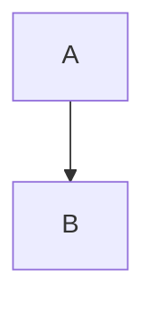
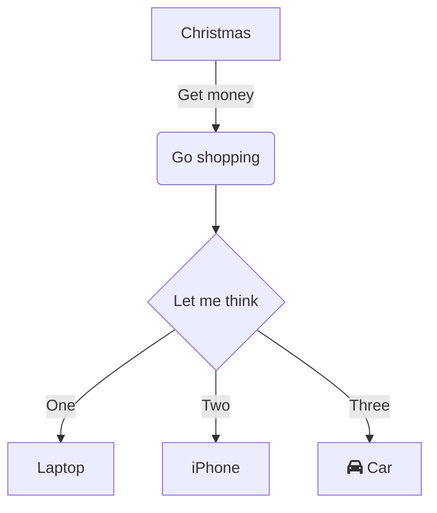

# Diagrams

---

## Simple Diagram
Press right/left arrow key to show next/previous part of the diagram.

<!-- Diagram with animation defined as script -->
<!-- that is associated by graph name -->
<!-- defined in attribute of parent or ancestor element -->

<div data-mermaid-graph-name="simple">



</div>

---

## Flow Chart
### animation defined in script

Press right/left arrow key to show next/previous part of the diagram.

<!-- Diagram with animation defined as script -->
<!-- that is associated by graph index -->



---

## Flow Chart
### animation defined in code block

Press right/left arrow key to show next/previous part of the diagram.

<!-- Diagram with animation defined as code block (mermaid-animation)  -->
<!-- on the same slide as diagram -->


```mermaid-animation
A
A-->B B 
B-->C C
C-->D D C-->E E C-->F F
```
